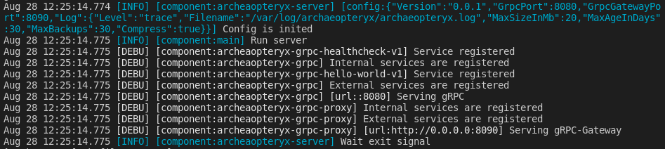

# archaeopteryx

[](https://codecov.io/gh/iakrevetkho/archaeopteryx)
[](https://pkg.go.dev/github.com/iakrevetkho/archaeopteryx)

This project is a prototype for microservice on Golang with all required dependencies

## How to use

`archaeopteryx` helps you to create service with gRPC, gRPC proxy for REST API and some editional features from the box.
All features can be found in the list

You can find example of project in the `example` folder.

### Config

Service has configuration, bases on https://github.com/jinzhu/configor.
Your application should reimplement config of server like:
```go
import (
	archaeopteryx_config "github.com/iakrevetkho/archaeopteryx/pkg/config"
)

type Config struct {
	archaeopteryx_config.Config
}
```

### Logger

Service has methods to create logger:
```go
import (
	"github.com/sirupsen/logrus"
	archaeopteryx_config "github.com/iakrevetkho/archaeopteryx/logger"
)

func main(){
    var log *logrus.Entry
    log = logger.CreateLogger("main")
}
```

All messages will be formatted with component name to make easy search by this name:



### Service server interface

All custom services should implements interface `service_server`:
```go
// IServiceServer - interface for services servers for archaeopteryx.
//
// All services should implements this interface
// to make possible archaeopteryx registrate services handlers in server
type IServiceServer interface {
	// RegisterGrpc - HealthServiceServer's method to registrate gRPC service server handlers
	RegisterGrpc(sr grpc.ServiceRegistrar) error
	// RegisterGrpcProxy - HealthServiceServer's method to registrate gRPC proxy service server handlers
	RegisterGrpcProxy(ctx context.Context, mux *runtime.ServeMux, conn *grpc.ClientConn) error
}
```

## Features

* health check bases on https://github.com/grpc/grpc/blob/master/doc/health-checking.md
* logger with logrus nested formatter (https://github.com/antonfisher/nested-logrus-formatter)
* logger writes data into the console and file, which is rotated with https://github.com/iakrevetkho/woodpecker
* config is inited bases on https://github.com/jinzhu/configor
* server is waiting terminate signals on run

## Install dependencies

```sh
make install
```

## Generate protobuf & docs

```sh
make generate
```

## Presequinces

`archaeopteryx` requires folder for log files.
To create it run:
```sh
sudo mkdir /var/log/archaeopteryx
sudo chown $USER /var/log/archaeopteryx
```

## Security

### TLS

For `TLS` connection security you need to generate certificate:
```sh
openssl req -newkey rsa:2048 -new -nodes -x509 -days 3650 -keyout key.pem -out cert.pem
```

`archaeopteryx` reads certificate and key from the config.

NOTE. Remember, that with TLS option enabled, use `https` instead `http` in your browser.

## Test

### Unit test

For unit tests use:
```sh
make test
```

### Lint

For lint use:
```sh
make lint
```

### gRPC

For testing gRPC API use [Kreya](https://kreya.app/)

Folder `kreya` contains Kreya project for working with the project.

Also `archaeopteryx` is compatible with [gRPC reflection](https://github.com/grpc/grpc/blob/master/doc/server-reflection.md)